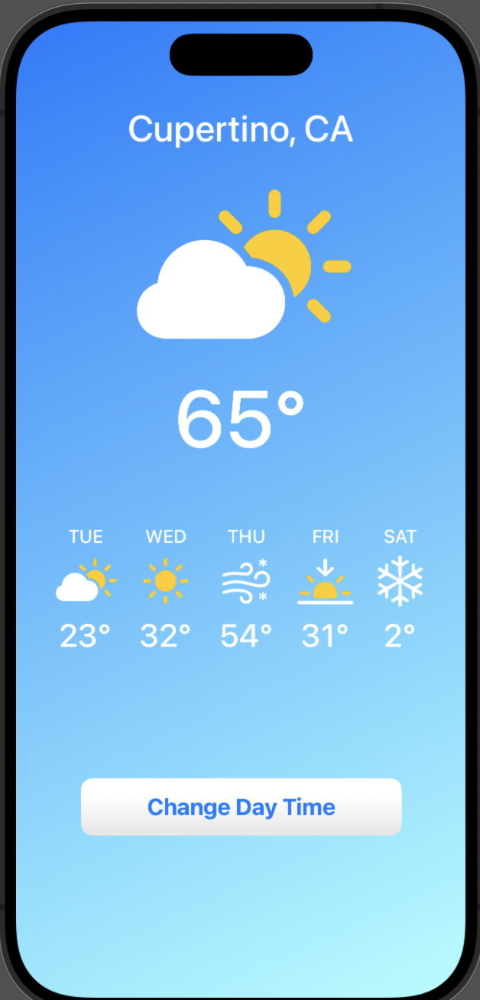
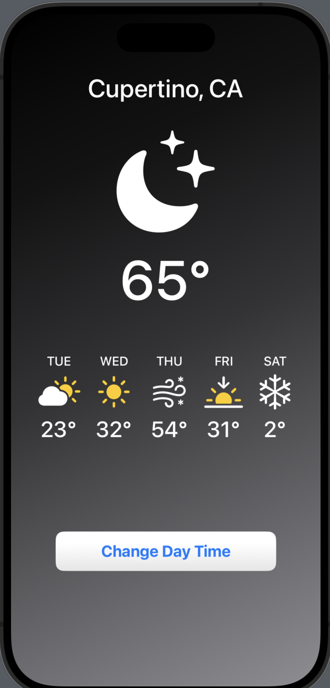

# WeatherApp

WeatherApp is a simple and elegant weather application built with Swift. It fetches real-time weather data from an API and displays the current temperature, sky condition (sunny, cloudy, etc.), and a multi-day forecast with a clean and user-friendly interface.

## Screenshots

  
  &nbsp;&nbsp;&nbsp;
  

